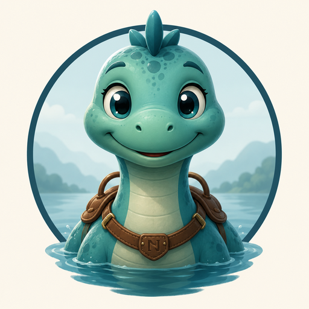

<p align="center">
  
</p>

# Nessy

[](https://github.com/jwcarman/nessy/actions/workflows/maven.yml)
[](https://opensource.org/licenses/Apache-2.0)
[='maven.compiler.release']/text()&label=Java&color=orange)](https://openjdk.org/)

[](https://sonarcloud.io/summary/new_code?id=jwcarman_nessy)
[](https://sonarcloud.io/summary/new_code?id=jwcarman_nessy)
[](https://sonarcloud.io/summary/new_code?id=jwcarman_nessy)
[](https://sonarcloud.io/summary/new_code?id=jwcarman_nessy)
[](https://sonarcloud.io/summary/new_code?id=jwcarman_nessy)
[](https://sonarcloud.io/summary/new_code?id=jwcarman_nessy)

An agent harness framework for Java.

## Read the docs

The [documentation site](https://jwcarman.github.io/nessy/) is the manual —
concepts, guides, examples, and reference, in one place. This README is just
the front door: enough to run something real and decide what to install.

## The five-minute example

Build a harness once, keep it, tell it things. Export a key and this makes a
real call:

```bash
export ANTHROPIC_API_KEY=...
```

```java
record Add(int left, int right) {}

class AddTool implements Tool<Add> {
    public String name() { return "add"; }
    public String description() { return "Adds two integers"; }
    public Class<Add> inputType() { return Add.class; }

    public Awaited<ToolResult> execute(ToolCallRequest<Add> call) {
        Add input = call.input();
        return Awaited.ready(ToolResult.ok(String.valueOf(input.left() + input.right())));
    }
}

var factory = new PekkoHarnessFactory(engine -> engine
        .system(actorSystem)
        .models(AnthropicModelProvider.fromEnv()));

Harness<String> harness = factory.createHarness(String.class, config -> config
        .type(AgentType.of("assistant"))
        .systemPrompt("You are a terse assistant.")
        .model(ModelId.of("claude-opus-4"))
        .renderer(UserMessage::of)
        .tool(new AddTool()));

try (var subscription = harness.subscribe(AgentId.of("scope-1"), event -> {
        if (event instanceof AgentEvent.TextDelta delta) {
            System.out.print(delta.text());
        }
    })) {
    harness.observe(AgentId.of("scope-1"), "what is 2+2?");
}
```

`observe` is a post, not a call: it returns as soon as the observation is
durable, and the answer is **narrated** rather than returned. Hand the engine
no `DataSource` and it builds an in-memory H2 and initializes it, so nothing
else is required to run this.

For a terminal agent, one call does the whole bootstrap — actor system,
cluster, harness and loop:

```java
public static void main(String[] args) {
    Repl.run(config -> config
            .systemPrompt("You are a helpful assistant.")
            .tool(new AddTool())
            .tool(new SendEmailTool(), binding -> binding
                    .approver(ConsoleApprover.atTheTerminal())
                    .describer(email -> "Send an email to " + email.to())));
}
```

## Try it

`nessy-examples` has three runnable modules. All three want an
OpenAI-compatible endpoint — [LM Studio](https://lmstudio.ai) on `:1234`
works, and costs nothing:

```bash
export OPENAI_API_KEY=not-needed
export OPENAI_BASE_URL=http://localhost:1234/v1
export NESSY_MODEL=<a model id your endpoint serves>
```

**`chat-cli`** — a terminal agent with a notebook and a plan, gated on a
tool that asks at the prompt:

```bash
./mvnw -q -pl nessy-examples/chat-cli -am compile exec:java
```

**`chat-web`** — the same agent as a page: streamed answers over SSE, an
approval desk you click, and `Last-Event-ID` resume when a browser
reconnects.

```bash
cd nessy-examples/chat-web && ../../mvnw spring-boot:run
```

**`watchman`** — the Spring Boot soak. It lives on a real box, does rounds
on a timer, proposes remediations it is not allowed to run itself, and waits
days for a person to answer through a page backed by
`nessy-spring-boot-starter`'s pending-approvals projection. It needs
Postgres and a real host (`df`, `systemctl`, `docker`), so it is not a
one-liner — `nessy-examples/watchman/soak.sh` runs it and then **asserts what
happened**, including that something actually parked, so a run that did
nothing fails rather than reading as success.

## Install

Nessy has not yet made a public release to Maven Central: until then, build
locally (`./mvnw install`) and depend on `0.1.0-SNAPSHOT`. Every module shares
`groupId` `org.jwcarman.nessy`.

Import the BOM to align versions, then pick the artifacts your application
actually needs:

```xml
<dependencyManagement>
  <dependencies>
    <dependency>
      <groupId>org.jwcarman.nessy</groupId>
      <artifactId>nessy-bom</artifactId>
      <version>0.1.0-SNAPSHOT</version>
      <type>pom</type>
      <scope>import</scope>
    </dependency>
  </dependencies>
</dependencyManagement>
```

Tool and policy authors compile against `nessy-api` alone; adapter authors —
a custom `Memory` or `Model` — add `nessy-spi`; an application building an
agent depends on `nessy-engine`, which pulls both in.

| Artifact | What it is for |
|---|---|
| `nessy-api` | the shared vocabulary: `Tool`, `Approver`, `Awaited`, messages, `AgentEvent` |
| `nessy-spi` | adapter authors — a custom `Memory` or `Model`, and `Schemas` |
| `nessy-engine` | the engine: `PekkoHarnessFactory`, the actor, the stores |
| `nessy-console` | terminal applications — `Repl.run` |
| `nessy-spring-boot-starter` | the one dependency a Boot application adds; no code of its own |
| `nessy-spring-boot-autoconfigure` | the beans, the `nessy.*` properties, and the approvals projection |
| `nessy-memory-notebook` | notes an agent keeps and recalls by heading |
| `nessy-memory-plan` | a plan an agent holds across turns |
| `nessy-memory-pipeline` | shaping the context a model call is built from |
| `nessy-intent` | the declared-intent claim channel |
| `nessy-tool-mcp` | importing a remote MCP server's tools |
| `nessy-testing` | test doubles, including a fresh in-memory database |

A model provider module sits alongside `nessy-engine` in every application:
`nessy-model-anthropic`, `nessy-model-openai` (which also speaks to any
OpenAI-compatible endpoint), `nessy-model-gemini`, or `nessy-model-bedrock`.
`nessy-model-discovery` resolves whichever one you shipped from the
environment.

## What Nessy gives you

| Capability | Site page |
|---|---|
| Agent as scope — one actor per id, durable state instead of a live instance | [Agent as Scope](https://jwcarman.github.io/nessy/concepts/agent-as-scope/) |
| Durable computation — parked calls, deadlines as rows, recovery on every activation | [Durable Computation](https://jwcarman.github.io/nessy/concepts/durable-computation/) |
| Tools — structured calls, sealed inputs, and deferring to the world | [Tools](https://jwcarman.github.io/nessy/concepts/tools/) |
| Authorization — approvers, reply tokens, and describing what a person is consenting to | [Authorization](https://jwcarman.github.io/nessy/concepts/authorization/) |
| Intent — the claim channel a model states and an approver may trust | [Intent](https://jwcarman.github.io/nessy/concepts/intent/) |
| Memory — the SPI a model call's context is actually built from | [Memory](https://jwcarman.github.io/nessy/concepts/memory/) |
| Storage — a table per thing, shaped for how it is read | [Storage](https://jwcarman.github.io/nessy/concepts/storage/) |
| Providers — a vendor gateway per provider, plus every OpenAI-compatible endpoint | [Providers](https://jwcarman.github.io/nessy/guides/providers/) |
| MCP — import a remote server's tools as ordinary tools | [MCP Clients](https://jwcarman.github.io/nessy/guides/mcp-clients/) |
| The harness — kept, not closed; observing, subscribing, and approval desks | [The Harness](https://jwcarman.github.io/nessy/guides/harness/) |
| Observability — narration, traces that make a tree, and metrics | [Observability](https://jwcarman.github.io/nessy/guides/observability/) |
| Spring Boot — a harness, the stores, and a pending-approvals page from `nessy.*` properties and beans | [Spring Boot](https://jwcarman.github.io/nessy/guides/spring-boot/) |

## Roadmap

Where this is all headed lives in [ROADMAP.md](ROADMAP.md) — memory that
learns, delegation that scales, and the road to a first release.

## Contributing

Contributions are welcome — see [CONTRIBUTING.md](CONTRIBUTING.md) for how to
get started, and [CODE_OF_CONDUCT.md](CODE_OF_CONDUCT.md) for the standards we
hold this project to. Please report security issues per
[SECURITY.md](SECURITY.md) rather than filing a public issue.

## License

Nessy is licensed under the [Apache License 2.0](LICENSE).

## The name

> **What's in a name?** Look at the middle of the word *har****ness***: the name
> was hiding inside the thing the whole time. And once your agent framework is
> named Nessy, the mascot picks itself — a certain famously elusive resident of
> Loch Ness, here wearing (what else?) a harness. Like her namesake, she's
> mostly calm water on the surface with a great deal going on underneath.
