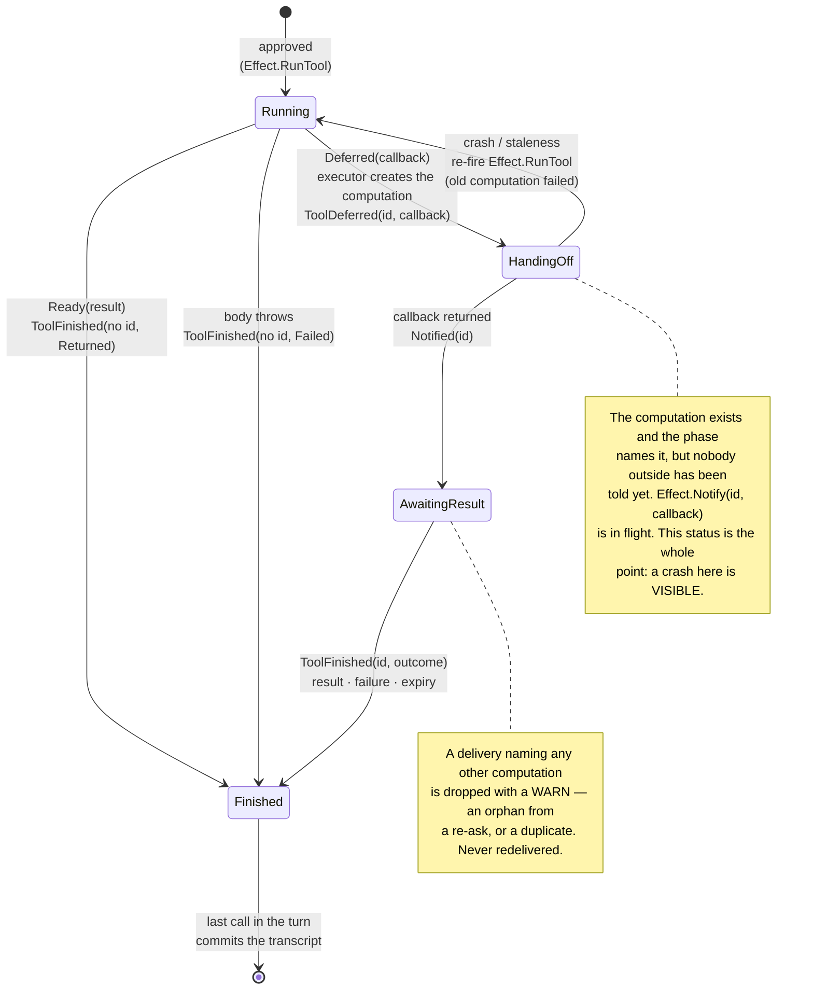

# Deferral by continuation — the tool call lifecycle

*2026-08-26. Proposes replacing `ToolContext.defer()` / `ApprovalContext.defer()`
with a continuation returned by the deferring party, a `Notify` effect, and a
lifecycle step that makes a lost notification recoverable. This document draws
the **tool call** half; the approval half is the same three moves against
different statuses and effects. Status: shape agreed in conversation, awaiting
James's review — the two new status names in particular.*

## 1. The lifecycle



## 2. What each step is

| status | meaning | who ends it |
|---|---|---|
| `Running` | the tool body is executing on an executor thread | the body, by returning or throwing |
| **`HandingOff(id)`** *(new)* | the computation is created and committed to the phase; the continuation has not run, so no external system has the id yet | `Effect.Notify` running the continuation |
| `AwaitingResult(id)` | an external system holds the id and owes an answer | a Continuum delivery |
| `Finished(result)` | the model will read this result on the next turn | — |

## 3. Why the continuation, and not `defer()`

Today a tool calls `context.defer()`, which creates the computation, folds
`ToolDeferred`, waits for the commit, and returns the id — a fold from inside
an effect. It works, and it is forced by the drop rule (an id that escapes
before the phase names it can receive an answer that is then dropped forever).
But it makes two wrong things representable, and we had to write code and
tests to police both:

- returning `Awaited.deferred()` without ever calling `defer()` — nowhere for
  the answer to go (`DEFERRED_WITHOUT_DEFER`);
- returning `Awaited.ready(x)` *after* deferring (`ANSWERED_AFTER_DEFERRING`).

With a continuation the tool hands back *what to do once the id exists*:

```java
return Awaited.deferred(id -> tickets.open(work, callbackFor(id)));
```

The id cannot exist before the fold, because the plumbing mints it after the
tool returns. Both failure modes become unrepresentable, both guards and their
tests delete, and `ToolContext` goes back to being a record — `call`,
`invocation`, `progress`, no collaborator.

## 4. Why `HandingOff` earns its write

`Effect.Notify` carries a lambda, so unlike every other effect it cannot be
reconstructed from the persisted phase after a crash — `outstandingEffects()`
rebuilds instructions from state, and state cannot hold a closure.

Without a status for it, a crash between the commit and the continuation would
leave a computation nobody was ever told about: invisible, and permanent. With
it, the phase records exactly that situation, and recovery is machinery we
already have — **re-fire `RunTool`**. The tool runs again from the top, mints a
fresh computation and a fresh continuation, and this time the handoff
completes. The first computation is failed explicitly (`CompletionDesk.fail`,
as the post-defer failure path already does) so its eventual delivery is a
dropped mismatch immediately rather than at the seven-day deadline.

So the closure stays unreconstructible and the *state* carries the recovery.
One extra substrate write per deferral, against a wait measured in hours.

## 5. Consequences to state plainly

- **Handoff becomes at-least-once.** If the continuation succeeds but the
  process dies before `Notified` folds, the re-ask runs the tool again and the
  external system may be asked twice. `ToolContext.invocation()` — the
  deterministic address digest, stable across every redispatch — is the
  idempotency key for exactly this, and the continuation shape makes it easier
  to teach: the tool now holds both ids at the moment it matters, the digest
  for *"have you seen this work before"* and the computation id for *"here is
  where to send the answer"*.
- **A re-run tool is heavier than a re-run approver.** The approval side of
  this pattern re-asks a decision; the tool side re-does work. The window is
  small, but the tool side must lean on the idempotency key where the approval
  side need not.
- **`Effect.Notify` is fire-once by construction**, and the grammar should say
  so rather than leaving a reader to infer it from a missing case in
  `outstandingEffects()`.

## 6. Open — James's call

1. **`HandingOff` is a placeholder name.** The existing statuses are named for
   what they await (`AwaitingApproval`, `AwaitingResult`); this one awaits its
   own continuation, which does not fit the pattern. `AwaitingHandoff`,
   `Notifying`, `Deferring` are the other candidates.
2. **Whether the approval side uses a second status or shares one.** Recovery
   differs (`SeekApproval` versus `RunTool`), so a shared status would need a
   discriminator; two statuses keeps the matrix honest at the cost of one more
   row.
3. Whether this lands before or after the executors stop taking a `Sink` (the
   separate simplification where `callModel` returns its outcome) — they are
   independent but touch the same files.
